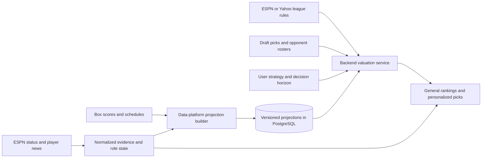

# Court Vision ranking engine research

September 5, 2026 · Architecture review, executable prototypes, historical experiments

**Recommendation: build a common projection layer, then value a player by the improvement they make to a legal roster under the league's actual scoring objective.** Use a variance-aware ranking as the general board and fallback. Add opponent-aware recommendations during drafts, and turn news into changes to availability, minutes and production distributions upstream of both.

The experiments support this direction, with limits. Updating minutes while retaining stable per-minute production reduced next-two-week points forecast error by **4.4%** versus season averages. In simplified historical redrafts, opponent-aware matchup scoring achieved **73.1% match score versus 69.7% for a strong variance-aware static baseline**, but lost to it in two of nine date/opponent-field combinations. These are exploratory simulations on one NBA season, not measured improvements to Court Vision users' draft outcomes. News handling is tested with synthetic evidence fixtures; we do not yet have historical news with ingestion timestamps to measure its predictive benefit.

All work is isolated in this directory. Production services and database contents are unchanged. [RESULTS.md](RESULTS.md) contains the generated tables; [results.json](results.json) includes per-draft observations, parameters, provenance and forecast errors by stat.

## What Court Vision already has

The source code is further along than some older architecture notes describe. In particular, a League model and a shared scoring vocabulary already exist.

| Existing component | What can be reused | Important boundary |
|---|---|---|
| [Scoring models](../../services/scoring/models.py), [points](../../services/scoring/points.py), [cv-core vocabulary](../../../cv-core/cv_core/scoring_vocab.py) | Canonical raw stat lines, provider mappings, custom point weights, category definitions and directions | Keep forecasts as raw stats. Stored `fpts` uses the platform default; custom leagues must apply their own weights. |
| [Category rankings](../../services/scoring/category_rank.py) | Signed per-game z-scores; shooting valued through extra makes relative to a volume-weighted reference | Already handles shooting volume correctly. It does not estimate future weekly variance or roster-specific win value. |
| [Draft fit](../../services/draft_fit.py) | Fixed draftable reference tier, own-roster category needs, explicit punts | Need weights are `1 + .25 × clipped deficit`, between .5 and 1.5. They do not depend on opponents or the probability of overcoming the deficit. |
| [Draft board](../../services/draft_board_service.py) | ESPN projections with prior-season fallback, market-only rookies, stable full-pool rank, fit rank, VORP, scarcity, eligibility/caps, injury discount and ADP availability buckets | Recommendation components are heuristic and additive. Fit does not see the other teams' rosters. |
| [Draft picks](../../db/models/drafts.py) | Team slot, ESPN team ID, pick order, keepers, punts, live draft synchronization | `_fetch_inputs` currently reduces picks to picked/mine sets and does not load the seat/team fields needed to reconstruct opponents. |
| [Preseason market pipeline](../../../data-platform/pipelines/preseason_market.py), [projection model](../../db/models/nba/player_projections.py) | Daily ESPN projections and market snapshots, atomic full-snapshot publication | Runs in the preseason window. Same-day writes replace a row; the board defaults to source `espn` and the global latest snapshot date. |
| [Breakout detection](../../../data-platform/pipelines/breakout_detection.py) | Depth-chart evidence, teammate absences, historical opportunity games, estimated minute boosts | Useful prior for role changes. Its score and selected opportunity-game history are not calibrated causal effects. |
| [Ownership trends](../../services/ownership_service.py), [player trends](../../services/trends_service.py) | Ownership velocity, rolling production and market attention | Ownership movement can describe market response; it is not by itself a production forecast. |
| [ESPN injury ingestion](../../../data-platform/pipelines/espn_injury_status.py) | Status changes and clearing stale injuries on return | The current payload supplies status, without injury detail or expected-return estimates. |
| [Scoring resolver](../../services/scoring/resolver.py), provider settings parsers | Points / each-category / most-category normalization | Parsers recognize roto, but the resolver only dispatches `categories` to category scoring; roto currently falls through to points. Roto needs its own supported objective. |

The read-only database probe found **26,422 box scores, 582 players, October 21, 2025–April 12, 2026**. It found no rows in `nba.player_projections` in the configured database. That is an observation about this connection, not a claim about every environment or future projection availability.

## Experiments and what they establish

### Forecasting: fast changes in minutes, slower changes in efficiency

The benchmark predicts each player's average line over the next 14 calendar days, conditional on playing. It has six non-overlapping target windows beginning January 12 through March 23, **2,170 player-window observations across 444 players**. A player needs at least 15 previous games and a recorded game in the prior 14 days to be eligible. Training uses only dates before the cutoff. Hyperparameters are fixed rather than selected on these holdouts.

| Forecast | Fantasy points MAE, lower is better | Interpretation |
|---|---:|---|
| Season average | 5.602 | Baseline |
| Last seven days | 7.334 | 30.9% worse; noisy short windows are a poor standalone forecast |
| Exponential weighting, six-game half-life | 5.396 | Faster adjustment without throwing out all older games |
| Last six games shrunk toward a 12-game season prior | 5.397 | Similar improvement with a simple regularized estimate |
| Exponentially weighted minutes × season per-minute rates | **5.353** | **4.4% better**; strongest tested aggregate result |

The last method also reduced minutes MAE from 3.918 to 3.440. Its paired points-MAE change was −0.249, with a player-cluster bootstrap interval of [−0.355, −0.146]. That interval resamples players, not independent seasons or shared calendar shocks. Do not interpret it as a production guarantee or proof that it beats the other improved models. The experiment omits **144 eligible windows with no future games**, so it measures production conditional on playing, not injury/availability forecasting. The historical input contains final corrected statistics rather than the exact data visible at each past timestamp.

**Build implication:** separate availability, minutes and per-minute production. A three-game shooting spike should receive more shrinkage than an announced starting-role change. The tested minutes estimator improves counting-stat forecasts; a production shooting model should estimate attempts and shooting probabilities separately and retain valid makes/attempt relationships.

### Category drafting: volume, volatility, team fit and opponent fit

The draft experiment uses three disjoint four-week historical target blocks, all 12 snake-draft seats and three opponent fields: balanced per-game z rankings, varied category preferences including occasional punts, and stronger variance-aware weekly rankings. There are **108 drafts per method, 864 drafts total**. Each draft has 12 teams × 13 players, selected uniquely from the top 220 players using training-only information. Every drafted player's actual games count; the comparison evaluates the hero against all 11 opponents in every target week.

| Draft policy | Category score out of 9 | Match score, wins + half ties |
|---|---:|---:|
| Existing per-game z-score function | 4.124 | 41.5% |
| Weekly-volume z-score control | 5.000 | 63.5% |
| Weekly variance-aware, G-inspired score | 5.250 | 69.7% |
| Existing roster-need fit function | 3.907 | 35.0% |
| Same need heuristic applied to G-inspired scores | 4.926 | 59.9% |
| Existing fit with fixed FT% + TO punts | 4.298 | 48.1% |
| Opponent-aware expected category score | 5.353 | 70.9% |
| Opponent-aware expected matchup score | **5.404** | **73.1%** |

The per-game score and fit policies call the real pure production functions. **This is an ablation of category scoring policies, not a replay of the complete production board:** projected games, position rules, the board's separate injury penalties, scarcity, streaming, lineups, market prices, keepers and future-pick lookahead are absent. The advanced policies use prior weekly totals including zero-game weeks, which capture volume and absences that the per-game baseline does not. The large gap against that baseline therefore cannot be attributed entirely to better category strategy. The `weekly_z` and `g_need_fit` controls make that distinction visible.

The G-inspired method and `weekly_z` have identical means and reference population; only the variance denominator changes. G-inspired scoring improves the overall match score by 6.2 percentage points over that control. Opponent-aware matchup scoring adds another 3.5 points overall relative to G-inspired scoring, but falls behind it in January against balanced opponents and in March against the strongest opponents. Repeated drafts share underlying player outcomes, so the 864 runs are not 864 independent samples of real-world efficacy.

Normal approximation scoring took about **13 ms p95 per hero pick** locally for the most-category policy. This excludes data loading, serialization, network latency and queueing; it establishes feasibility for a prototype, not an API latency promise.

**Build implication:** introduce better weekly projections and a variance-aware general board first. Keep opponent-aware scoring behind a measurable rollout until full roster constraints, forecast calibration and more seasons are evaluated. Simply increasing current need weights is not supported by these results.

### Three mechanisms worth preserving

1. **Win a contestable category.** In a synthetic normal model, improving a four-standard-deviation deficit by one standard deviation gains only 0.0013 expected category wins. The same improvement to a near-tied category gains 0.3558. A deficit-only heuristic can prefer the first; win-value pricing prefers the second. This is about the actual matchup distribution, including remaining draft opportunities.
2. **Count usable production.** In a two-slot points example with an incumbent 48-point guard and 20-point center, adding a 44-point guard gains zero startable points, while a 40-point center gains 20. The prototype solves the assignment exactly and prevents a multi-eligible player from filling two slots. Season and daily scheduling remain future work.
3. **Do not mistake independent categories for joint win probability.** With correlated synthetic category margins, an independent model estimates an 83.8% matchup score while joint sampling gives 67.8%. Expected category totals agree exactly. This demonstrates why most-category leagues need covariance validation. It does not claim that real NBA category correlations produce this specific gap.

An additional historical diagnostic evaluates an eight-week synchronized calendar bootstrap against the normal model on the same finalized rosters. The bootstrap did **not** improve match-score mean squared error in this experiment. Eight historical weeks are too sparse to assume empirical resampling is automatically better. We should validate shrinkage, seasonality and calibration before exposing precise probabilities. These errors include half-credit tie outcomes, so they are labeled utility MSE rather than binary-event Brier scores.

## Recommended valuation methods

### One projection, several objectives

Forecast a raw statistical distribution independent of ESPN or Yahoo. Then score that distribution with normalized league rules and a decision horizon. The same projection should power drafts, player profiles, trade analysis and waiver recommendations.

For a game-day scenario, factor production into:

`playing indicator × minutes conditional on playing × per-minute production conditional on role`

Model these variables jointly: an injury can change both play probability and minutes if active; extra usage can increase turnovers and reduce efficiency. Do not assume that multiplying marginal expectations is always valid. Generate makes conditional on attempts so FG%, FT% and 3P% remain coherent. Derive double/triple-double probabilities from game-level joint outcomes rather than an average stat line.

For preseason forecasting, blend ESPN projections, prior seasons and role/age priors with weights validated on earlier seasons. Account for correlated sources and stale inputs. Rookies need wider role-conditioned priors; preserve market-only/unscored rows where information is inadequate. During the season, the minutes/per-minute model tested here is a low-complexity baseline before attempting a state-space or change-point model. A role event can switch the minutes state promptly while allowing skill rates to adjust more cautiously.

Return separate quantities for per-game ability, expected usable games, remaining-season totals and uncertainty. Draft horizon should normally cover the season, with optional playoff-week emphasis; a next-seven-days waiver view should use a different horizon.

| League objective | General ranking | Contextual value of a candidate |
|---|---|---|
| Total points | Expected league-scored usable points above feasible replacement | Improvement to optimized roster points over the chosen horizon |
| H2H points | Same starting point, with weekly variance available | Improvement in expected weekly match score; risk preference can differ for favorites and underdogs |
| H2H each category | Variance-aware signed category contributions | Change in the sum of category win probabilities, with correct tie credit |
| H2H most categories / one win | Variance-aware shortlist | Change in `P(category wins > losses) + tie_credit × P(equal)` |
| Rotisserie | Season totals and standings-gap value | Change in expected standings points; optional later objective of probability of winning the league |

There is research precedent for variance-aware static scoring: Rosenof's G-score adds period-to-period variability to the familiar player-to-player scaling, with simulation evidence and simplifying assumptions. Our prototype applies that idea to weekly counting and extra-makes features, not the paper's exact percentage formula. [Static valuation research](https://arxiv.org/html/2307.02188v5).

The dynamic H-scoring framework connects forecast distributions, category win probabilities and format-specific objectives, while optimizing future draft strategy. Our opponent model is a simpler greedy approximation with an average remaining-pool completion; it does not reproduce the paper's future-strategy optimization. [Dynamic valuation research](https://arxiv.org/html/2409.09884v1).

Roto needs a distinct objective. A useful first step is expected category standings points: one base point plus expected pairwise credits against every opponent, summed across categories. Optimizing probability of first overall is harder and should be evaluated separately. [Roto optimization research](https://arxiv.org/html/2501.00933v1).

### Points leagues: replace additive bonuses with a roster counterfactual

Calculate `E[utility(roster + candidate + legal continuation)]` and compare it with the relevant alternative, including the best feasible replacement. Optimize the lineup assignment under the provider's slots, primary-position caps where applicable, lineup locks, game limits and acquisition rules. This gives scarcity and flexibility value through their effect on usable starts. Avoid charging separate scarcity/flexibility bonuses for effects already captured by the optimizer.

For injured players, integrate expected missed games and replacement production over the appropriate dates. Once availability is in the projection, remove the overlapping fixed injury discount. A risk preference may price uncertainty, but it should be explicit and should not count the same missed games twice.

Auction support can convert marginal values into bids subject to remaining budget, mandatory minimum bids and remaining roster slots. Do not reinterpret ESPN editorial auction values as a probability distribution or as the user's exact willingness to pay.

### Category leagues: opponents, percentages and future picks

Keep a stable full-pool general rank and a separate personalized pick value. Estimate each opponent's completed roster distribution from their actual picks plus legal future picks. For an in-season general view, average over the league or its schedule; for a specific matchup, use that opponent and matchup period. Early in a draft, opponent estimates should shrink strongly toward league priors. Missing roster players must widen uncertainty rather than silently become zero-value players.

For FG% and FT%, evaluate **the ratio of the completed team's makes and attempts** in each scenario. The marginal effect depends on your current attempts and accuracy, not only a pool-average shooter. For most-category outcomes, simulate joint stat outcomes or use a validated covariance approximation. The normal model in this directory accounts for makes/attempt covariance within each ratio but assumes independent categories when computing matchup probability; it is a screening model.

Start with a fast pass over the full board, then evaluate a shortlist of roughly 20–30 players using common random scenarios. Each scenario must allocate remaining players once, obey slot constraints, and include plausible opponent draft policies. Use the same random draws across candidate counterfactuals to reduce ranking noise. Adapt the number of scenarios when two candidates are close.

Add two-turn lookahead after the basic model: compare taking player A now and the likely best option at the next turn with taking B now and the likely next option. The market's ADP helps model these choices. It should not directly raise a player's basketball forecast. Court Vision already appropriately uses availability buckets because a single ADP is not a distribution; retain those until draft captures support an empirically calibrated survival model.

### Punt strategy should constrain choices, not rewrite league rules

Manual punts already exist in `DraftSession.punts`; extend them with a reusable league strategy profile. Offer balanced, chosen punts, protected categories, and suggested alternatives. A soft preference can differ from a hard punt. Keep points and category strategies in native units rather than trying to express everything on the existing nonnegative fantasy-points proxy scale.

For a general strategy ranking, zero the punted dimensions while holding the reference cohort fixed and label the result as strategy value. In the actual matchup simulator, **all scored categories still count**. Punting two of nine does not change the rule to winning four of seven; those categories can still be lost, tied or accidentally won. Evaluate what the chosen strategy does to the true nine-category outcome. Zero contributions are not equivalent to zero probability of winning a category.

For suggested strategies, evaluate the no-punt case, one-category punts and two-category punts: 46 alternatives in nine-category leagues. Screen cheaply, then run legal roster continuations for the strongest few, including user-protected categories and market opportunity cost. Present two or three alternatives with their expected outcomes and sensitivity. Do not automatically switch the user's chosen strategy after every pick. Roto's standings penalties make default punt advice especially inappropriate without evaluating the full objective.

## News as evidence for projections

### Inputs and interpretation

Start with the existing ESPN status feed and official NBA/team reports, then add structured player news if coverage justifies it. The NBA describes ongoing injury-report updates; participation reports are useful evidence for availability, while they do not by themselves specify a replacement's role. [NBA official injury reporting](https://official.nba.com/nba-injury-report-2025-26-season/).

SportsDataIO documents year-round NBA player news supplied by RotoBaller, plus injuries, depth charts and projections. It is a concrete candidate for a provider evaluation, not an integrated or benchmarked feed here. Test delivery delay, NBA-ID resolution, historical timestamps and permitted content use before selecting it; no purchase or account change was made. [SportsDataIO NBA workflow](https://sportsdata.io/developers/workflow-guide/nba).

Use a structured parser first for availability, transactions and confirmed lineups. A language model can extract reported facts from prose into a constrained schema: affected player, event kind, effective dates, role assertion, evidence span and source. Treat article content as untrusted data; it cannot issue instructions or directly set ranks. Validate player identity, timestamps and effect bounds in code. Separate extraction certainty, source reliability and forecast uncertainty; a model's self-reported confidence is not a calibrated effect probability.

| Event | Projection input | Typical horizon handling |
|---|---|---|
| Out for a specified game | Probability of playing that game | Expires after that game; no arbitrary season-wide percentage penalty |
| Longer absence / return timetable | Distribution of return dates, post-return minutes | Update with newer evidence; avoid a precise return date when none is reported |
| Confirmed starting role / minutes limit | Minutes distribution and conditional role | Durable until superseded or until the stated interval ends |
| Teammate absence | Team minute allocation and conditional usage | Shared cause with effects on several players; conserve team minutes |
| Trade / signing | Team membership, depth chart, competition for minutes | Structural state change; no generic sentiment decay |
| Unconfirmed coach optimism / rumor | Small provisional scenario or display-only explanation | Source-dependent expiry/decay; cannot outweigh stronger contradictory evidence |
| Strong game recap / ownership rise | Observation or market response | Avoid adding an effect already present in box scores or projections |

Reuse breakout detection's depth-chart and opportunity-game features as priors. Its historical selection of high-minute games can contain confounding from rest, blowouts and roster moves. Fit a model of minutes conditional on team availability and role, validate out of time, and conserve approximately 240 regulation team minutes per scenario, with overtime modeled separately. Do not grant every possible beneficiary the full missing starter's minutes.

### Event lifecycle and double counting

Persist publication time, first observation time, effective interval, source identity, canonical NBA player ID, event cluster, revision/supersession links and evidence. Cluster syndicated articles about the same underlying event. Ten copies of one report are not ten independent confirmations. Resolve contradictory reports into a current state, retain the history, and quarantine ambiguous player mappings instead of relying on name alone.

A projection must record which event versions it already reflects. New ESPN forecasts may already incorporate an injury or role change; use explicit lineage when available and conservative reconciliation when it is not. Never repeatedly add a minutes boost to the previously boosted projection. Recompute from a known baseline and the active evidence state. An absence and its breakout-beneficiary effect share one cause rather than two bonuses.

The synthetic fixture starts at 22 minutes and assumes an 80% chance of an eight-minute role increase. It produces 28.4 expected minutes. Duplicate reports leave that unchanged; future/unobserved reports have no effect; absorbed evidence is not reapplied; expiry restores the baseline in this fixture. At 1.1 points/minute, the uplift is **7.04 points per affected game**, but only **0.65 points per game averaged over a 65-game season if it lasts six games**. A short-term waiver opportunity should therefore move much more than its season-long draft value.

These effects and probabilities are illustrative assumptions. The prototype does not implement automated extraction, joint teammate allocation, source calibration or live ingestion. A historical news benchmark needs publication **and** first-seen times, not a retrospectively assembled collection of articles about known breakouts.

## Fit with the current architecture

Keep the existing service boundaries: data-platform writes shared basketball facts; backend owns migrations and reads forecasts; cv-core holds reusable pure math; frontend renders both general value and personalized recommendations. The current Go lineup optimizer can continue consuming a scalar for its existing use cases. A nonlinear draft recommendation service should have a separate objective rather than silently pushing a team-dependent win probability into the optimizer's additive `avg_points` contract.



### Storage and computation changes

Proposed migrations live in `backend/migrations`; mirror models in backend and data-platform using the existing drift checks.

| Proposed record | Contents and publication rule |
|---|---|
| `nba.player_events` | Append-only source events and revisions, canonical identities, published/observed/effective times, cluster and supersession IDs, extraction version, evidence location |
| `nba.projection_runs` | Model version, input cutoff, baseline/source versions, horizon, status, complete player-universe manifest and active revision |
| `nba.player_projection_versions` | Raw means, games/availability distribution, minutes and rate parameters, uncertainty representation, generated timestamp and input-event lineage |
| `nba.player_projection_heads` or equivalent manifest map | Each player's active version within an atomically published complete generation; unchanged players retain valid previous versions |
| League/user strategy record | Punts, protected categories, horizon and risk preference; request-local overrides for strategy comparisons |

Do not implement incremental updates by inserting one player's row with a new `as_of_date` and leaving the current “global latest date” reader in place: that reader would select only the partial new snapshot. Publish a complete manifest atomically, or resolve the latest applicable version per player with a consistent generation. Keep the current daily ESPN snapshots as source inputs.

In data-platform, add idempotent evidence ingestion and projection refresh pipelines through the existing registry and pipeline-run logging. New evidence marks affected players and teammates for recomputation; completed games update the statistical baseline. Persist a small database work queue with unique deduplication keys and retry/lease state if needed. The existing scheduler can poll it; there is no initial need for another service or a streaming platform. Source ingestion continues outside the preseason-market gate.

In backend, add a pure `services/valuation` layer and a thin data-loading service. Extend `BoardInputs` with rosters by seat/team, projection generation, horizon and strategy. Reuse existing draft geometry, cap checks and unresolved-player handling. Keep the current `run_db` fetch / `run_cpu` scoring split. Share small, proven math functions in cv-core after their contracts stabilize, without moving database models into it prematurely.

Use a cache key containing the full scoring fingerprint **including category direction**, horizon, model/projection generation, roster/draft revision, eligibility/rules revision and strategy hash. Existing ranking caches use a five-minute default TTL; event-driven revisions need explicit generation keys/invalidation across replicas. The existing category fingerprint includes keys and win mode but not category direction, so it needs expansion for fully correct custom rules. User-specific boards must remain private. An unchanged model with newer input data should still get a new projection generation.

### ESPN first, Yahoo through the same engine

ESPN's scoring modes and Yahoo's `head`, `headone`, `headpoint`, `point`, and `roto` already map into canonical fields in the parsers. Retain the distinction between H2H points and total-season points instead of losing it inside the broad `points` type. Provider data should determine scoring weights, category direction, matchup length and roster constraints; a platform default is only an explicitly labeled fallback.

ESPN eligibility and primary-position cap IDs are different spaces, already distinguished by the board. Yahoo has its own eligibility and roster semantics. Add adapters that return canonical eligible slots and cap rules; never reuse ESPN eligible-slot integers or ESPN primary-position caps for Yahoo. Extend normalization for lineup locks, game/position limits, acquisition rules and playoff periods before claiming full league compatibility. Unsupported scoring stats or bonus rules should be surfaced explicitly, not silently replaced by standard nine-category scoring.

Yahoo's current documentation exposes league settings and date-specific basketball rosters, suitable for this provider-neutral design. [Yahoo Fantasy API documentation](https://sports.yahoo.com/developer/docs/). However, the local Yahoo parser explicitly notes that it was tested on synthetic fixtures after a 403 problem. Live settings, roster, eligibility and draft-state parity remain an integration requirement; this investigation did not verify a working Yahoo connection.

### Product output and freshness

Keep “overall value,” “value for your team” and “market price” distinguishable. A recommendation can explain which category contests it improves, what is already secure, what the user is punting, and why another player may be available later. Report forecast changes in native units alongside rank movement, because rank movement can come from other players changing. Do not present the existing clamped, offset category proxy as an additive measure of actual wins.

Suggested response metadata: `projection_version`, `model_version`, `as_of`, `source_observed_at`, `horizon`, `objective`, `baseline_value`, `marginal_value`, per-category effects, uncertainty band, strategy, market snapshot time and evidence links. Show model-generated explanation numbers only when the underlying data support them. Before calibration, use ordinal strength and uncertainty labels rather than a precise “78% chance” badge.

Choose an initial **target** of reflecting an accepted event within two minutes of ingestion, subject to source limits; measure upstream publication-to-ingestion delay separately. A fast processor cannot eliminate a slow provider. Refresh shared projections once per event generation and rescore each active league from that shared data. Keep the last valid generation on feed failure and make its age visible. Rank and forecast changes need comparable cohorts, horizons and model versions; model upgrades should not masquerade as overnight player risers.

## Implementation order and acceptance evidence

1. **Projection foundation and auditability.** Add immutable intraday versions, per-player lineage, a complete active manifest and horizon-specific availability. Start collecting timestamped event history now. Run the tested minutes/per-minute baseline beside existing forecasts. Validate raw-stat error, minutes, availability, coherent shooting totals and missing-player coverage.
2. **General rankings and points draft value.** Add weekly variance-aware category value and expected usable points with real ESPN slots/schedules. Preserve the current board as a baseline. Measure predictive error and decision regret against feasible alternatives, including injured-player replacements and nonlinear point bonuses.
3. **Opponent-aware category recommendations.** Reconstruct every draft roster from existing picks. Add each-category and most-category objectives, partial-roster priors, legal continuations and manual strategy constraints. Extend the real draft replay harness, then benchmark across seats, league sizes, category sets and opponent policies. Evaluate probability calibration and stability as well as wins.
4. **News adjustments and explanations.** Begin with confirmed availability, starting roles and minutes limits. Reuse breakout evidence. Compare statistical-only, structured-event and prose-extraction variants on event-stratified future windows. Measure direction accuracy, false alerts, benefit over provider projections and time gained over ADP/ownership response.
5. **Strategy search, lookahead, Yahoo and roto.** Add suggested punts and two-turn draft evaluation once earlier components have stable counterfactuals. Validate Yahoo with real provider fixtures. Implement roto as its own objective and benchmark it separately; the current experiments do not establish roto performance.

The next evidence gap is data, especially timestamped news and preseason projections. Add prior seasons and genuine preseason holdouts; the current midseason redrafts are not a substitute. For backtests, enforce `observed_at <= decision_time` for every input and preserve correction versions. Avoid treating draft seats, players and weeks as independent when computing uncertainty; report results by season, time block and opponent field. Include a stronger weekly-volume baseline in every comparison so freshness and category intelligence receive separate credit.

Before a user-facing rollout, test full scoring semantics, category directions, zero-attempt behavior, tied matchups, dual eligibility, game caps, keeper states, missing identities and evidence retractions. Track p95 service latency, input age and ranking churn under load. Keep the proven baseline available when a new model lacks data or exceeds its compute budget. No model should be promoted merely because it wins this single-season experiment.

## Reproduce and inspect

Run from `backend/` with the existing virtual environment; NumPy is already pinned in backend requirements. No app startup or ORM import is needed.

```bash
.venv/bin/python experiments/ranking_engine/export_history.py
.venv/bin/python experiments/ranking_engine/run_experiments.py
.venv/bin/python -m unittest discover -s experiments/ranking_engine -p 'test_*.py' -v
```

The exporter reads only public basketball facts through an explicitly read-only transaction; it never queries user tables or emits connection details. `data/history.json.gz` and its manifest are retained locally and ignored by git. Re-exporting after database corrections can produce a different checksum; retain the original local export to reproduce this exact dataset. `--quick` runs only three seats per scenario and overwrites the output with clearly marked quick-run results.

The 24 invariant tests cover raw shooting aggregation, makes/attempt covariance, scoring direction, ties, exact lineup assignment, duplicate/retracted/expired evidence, first-seen timestamps, baseline absorption and the requirement that changing future box scores cannot change training inputs. `engine.py` contains research math, not a production API. `run_experiments.py` contains the design and all fixed parameters. No new dependency, migration, provider subscription or deployment is required to inspect the results.
